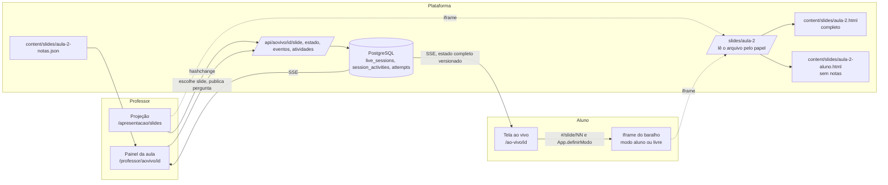

# Auditoria de arquitetura e experiência: Aula 2, professor e aluno

> **Situação em 22/09/2026.** O baralho de 50 slides descrito aqui foi aposentado da plataforma: a Aula 2 é apresentada e conduzida pelas páginas dos capítulos 4, 5 e 6, como as outras aulas, e os endereços do baralho redirecionam para o conteúdo equivalente. Este documento fica como registro da arquitetura que valeu até essa data. A decisão e o desenho que a substituiu estão em `docs/NARRATIVA_AULA_2.md`.

Data de referência: 21 de setembro de 2026. Branch `claude/new-session-d2yt8t`. Ambiente: sessão local com Node 22.22, PostgreSQL 16, Chromium 1194 (Playwright 1.56), servidor Next.js 16.3 em modo `dev`, base semeada por `db:seed` e conteúdo importado por `content:import`. Nada aqui tocou produção.

Convenção usada em todo o documento: **evidência** é o que o código, o banco ou o navegador mostraram; **inferência** é o que se conclui; **recomendação** é o que fazer. Toda medida traz a origem e a data. O que não foi verificado está dito como não verificado.

Os documentos irmãos são `ARQUITETURA_PROPOSTA.md` (estrutura, estados, contratos e decisões), `PLANO_MELHORIAS.md` (mudanças, critérios de aceite e status) e `VALIDACAO_JORNADAS.md` (cenários executados e evidências).

## 1. Escopo e método

O objeto é a Aula 2 ("Entender as três técnicas"): 50 slides interativos em HTML sobre regressão logística, árvore de decisão e gradient boosting, conduzidos ao vivo pela plataforma e estudados depois pelo aluno. O restante da plataforma (capítulos, trabalhos, presença, teste cego) entra apenas onde a jornada da Aula 2 passa por ele.

Método, na ordem em que foi executado:

1. Leitura das instruções do repositório (`README.md`, `docs/`, `aula_credito_html/LEIA_PRIMEIRO.md`, `00_guias/`, `02_controle/`) e do código das camadas envolvidas.
2. Ambiente levantado do zero: migrações, semente, importação, compilação da aula, servidor.
3. Jornadas executadas em Chromium por script (`professor` e `aluno`, dois contextos autenticados), com registro de console, tempos, acessibilidade (axe-core) e capturas. Relatório bruto: `jornadas.json` da sessão (fora do repositório); capturas selecionadas em `docs/capturas/aula2-*.png`.
4. Varredura de estados extremos dos 50 slides em jsdom: cada controle no mínimo e no máximo, campos vazios e com lixo, todos os botões por três rodadas, impressão, reinício.
5. Diagnóstico, correções incrementais verificadas, e os quatro documentos.

## 2. Mapa da arquitetura atual

### 2.1. Fatos observados

| Camada | Onde | O que faz | Evidência |
|---|---|---|---|
| Baralho da aula | `aula_credito_html/app/` (núcleo, dados, 50 slides, estilo), compilado por `build.mjs` | HTML único, script clássico sem framework, KaTeX embutido, palco fixo de 1600 por 900 escalado por `transform`; rota de slide em `#/slide/NN`; modos por parâmetro de URL | `app/nucleo/90-app.js`, `build.mjs`, `dist/aula_credito.html` (1.325 KB) |
| Cópia servida | `content/slides/aula-2.html` (e agora `aula-2-aluno.html`, `aula-2-notas.json`) | A rota `/slides/aula-2` lê do disco depois de validar sessão e turma | `src/app/slides/aula-2/route.ts` |
| Sessão ao vivo | `src/lib/services/live.ts`, `src/app/api/aovivo/[id]/*` | Fonte de verdade no PostgreSQL (`live_sessions.current_slide`, `state_version`); SSE envia o estado completo a cada mudança de versão, com atualização periódica como alternativa | `eventos/route.ts` (laço de 1,5 s), `use-live.ts` |
| Painel do professor | `src/app/professor/aovivo/[id]/page.tsx`, `src/components/live/live-teacher.tsx` | Escolhe o slide, abre a projeção, publica perguntas, abre chamada | página e componente |
| Projeção | `src/app/apresentacao/slides/page.tsx`, `projecao-slides.tsx` | Iframe com o baralho; lê o hash a cada troca e publica na sessão | componente |
| Tela do aluno | `src/app/(app)/ao-vivo/[id]/page.tsx`, `live-student.tsx` | Iframe com o baralho em modo aluno (segue) ou livre (navega), perguntas ao lado, presença | componente |
| Roteiro | `src/lib/content/roteiro-aula-2.ts` | Liga cada slide às páginas do apêndice que ele cobre; valida o número do slide no servidor | `slideValido` usado por `setCurrentSlide` |
| Persistência do aluno | `attempts` (respostas às perguntas), `checkin_evidence`/frequência | Só o que passa pela API é gravado; a exploração dos slides não é enviada a lugar nenhum | `live.ts`, esquema |

### 2.2. Onde vive cada estado (antes desta revisão)

| Estado | Dono | Fonte de verdade | Sobrevivia a: trocar slide / reiniciar / recarregar / fechar aba / outro aparelho |
|---|---|---|---|
| Slide no ar | professor | `live_sessions.current_slide` | sim / não se aplica / sim / sim / sim |
| Slide que o aluno vê seguindo | servidor | idem | idem |
| Exploração de um slide (controles, exercício, escolhas) | quem mexe | memória do iframe (`estados` em `90-app.js`) | sim / só o slide reiniciado / **não** / não / não |
| Último slide aberto no arquivo | navegador | `localStorage`, chave única para todos os usuários da máquina | sim / sim / sim / sim / não |
| Respostas às perguntas do professor | aluno | tabela `attempts`, idempotente por `client_request_id` | sim / não se aplica / sim / sim / sim |
| Modo seguir ou livre | aluno | estado React da casca | sim / sim / **volta a seguir** / idem / idem |

Inferência: a plataforma já tinha o estado coletivo (sessão, perguntas, presença) no lugar certo, com versão e idempotência. O estado individual da exploração era o elo fraco: vivia só na memória do iframe e era descartado por qualquer recarga, inclusive a recarga provocada pela própria casca ao trocar de modo.

### 2.3. Hipóteses que ficaram a verificar

- Tela cheia acionada de dentro do iframe: o Chromium headless devolveu `fullscreenElement` verdadeiro, mas a política de tela cheia varia por navegador e por a janela ter sido aberta por script. Verificar no projetor real.
- Firefox e Safari: nenhuma verificação nesta sessão; o baralho foi verificado apenas em Chromium.
- Comportamento do SSE atrás do proxy do provedor de hospedagem: a atualização periódica cobre a queda, mas o tempo de detecção depende do provedor.

## 3. Jornada do professor

| Etapa | O que existe | Achado | Situação |
|---|---|---|---|
| Preparar a aula | Cartão da turma em Início, "Iniciar aula" em um clique, encontros criados por "Criar as quatro aulas" | A turma recém semeada não tem encontros; sem eles não há sessão. O manual descreve o botão, mas o painel de Início não avisa a falta. | recomendação P2 |
| Escolher o slide inicial | Seletor com 50 opções e botões Anterior e Próximo no painel; Home, End, índice por bloco e `#/slide/NN` na projeção | Índice sem busca; os títulos do seletor eram os do roteiro (tema), diferentes dos títulos projetados | corrigido: filtro no índice, seletor com o título projetado e tema como apoio |
| Projetar | Janela separada, setas, o slide publicado pela casca a cada troca de hash | **A janela projetada era o arquivo completo: a tecla `p` e o botão Professor abriam as notas e as respostas na tela da turma; Imprimir e Estudo também estavam lá** (`docs/capturas/aula2-projecao-notas-antes.png`) | corrigido: modo `projecao` sem notas, impressão e modo estudo |
| Conduzir uma explicação | Notas de condução, respostas, cuidados e transição existem nos 50 slides, mas só dentro do arquivo | **Não havia visão do apresentador**: o painel mostrava número e título; para ler as notas o professor precisava abri-las na janela projetada | corrigido: bloco "Roteiro do slide no ar" no painel, com condução, respostas (fechadas por padrão), cuidados, transição e "Avançar para NN" |
| Interagir com um exercício | Exercícios 20, 30 e 42 com conferência local e solução em etapas; "Reiniciar exercício" em cada um | Reinício é por slide e não toca os outros (verificado em jsdom nos 50) | adequado |
| Perguntar à turma | Perguntas das páginas do apêndice ligadas ao slide pelo roteiro; perguntas novas na hora; rodadas antes e depois | O fluxo exige escolher a página no seletor de 180 páginas quando o slide não tem página ligada (slides 01 a 06, 15, 17, 18, 20, 43 a 50) | recomendação P2 |
| Retomar o roteiro | "Voltar ao slide do professor" existe para o aluno; para o professor, o painel e a projeção sempre refletem `current_slide` | adequado | |
| Falha de rede | A projeção avisava e continuava; o slide perdido só era republicado na troca seguinte | corrigido: reenvio a cada 3 s até confirmar, com aviso e confirmação de recuperação | |
| Encerrar | "Encerrar aula" fecha perguntas abertas | adequado | |

Inferência: o professor sabia onde estava, mas não o que dizer sem expor a turma às notas. A separação entre tela projetada e material reservado era a lacuna mais cara da jornada.

## 4. Jornada do aluno

| Etapa | O que existe | Achado | Situação |
|---|---|---|---|
| Acessar | Aviso "A aula ao vivo começou" em Início; `/ao-vivo/<sessão>`; matrícula validada no servidor | adequado | |
| Entender o objetivo | Cada slide traz trilho do bloco, título, subtítulo, conclusão e fonte dos números; resumo textual oculto para leitor de tela | O aluno não recebia orientação sobre o que fica salvo e onde | corrigido: linha "O que fica salvo" sob o baralho |
| Explorar e experimentar | Controles com rótulo, unidade, domínio, passo e entrada numérica equivalente; selo "simulação" ao alterar um perfil | adequado (verificado em 12, 09, 46, 47, 25) | |
| Responder e receber feedback | Exercícios do baralho conferem localmente e explicam a alternativa; perguntas do professor vão ao servidor e o resultado só sai quando ele libera | adequado; o gabarito não chega ao aluno antes da liberação (verificado no estado da sessão) | |
| Navegar por conta própria | Botão troca o iframe para modo livre | **Trocar de modo recarregava o arquivo e apagava a exploração** | corrigido: modo trocado em tempo de execução, sem recarga |
| Recarregar | Slide do professor volta; resposta enviada volta | **A exploração dos slides sumia sem aviso** | corrigido: sessionStorage por aba, versionado e por usuário; aviso do que é salvo |
| Abrir o material por conta própria | Cartão em Aulas e Materiais leva a `/slides/aula-2` | **O aluno recebia o arquivo completo: botão Professor, notas, respostas e apêndice de notas na impressão**, ao contrário do que o teste de aceitação afirmava sobre a tela ao vivo (`docs/capturas/aula2-projecao-notas-antes.png` mostra as mesmas notas) | corrigido: variante compilada sem notas, servida pelo papel; quarta rodada: o cartão leva a `/aulas/aula-2`, abertura e página por slide na moldura da plataforma, com caminho de volta |
| Celular e teclado | Abaixo de 1100 px o baralho entra em modo estudo; setas e Tab funcionam no modo livre; seguindo o professor, as setas não trocam o slide | Botões compactos com 32 px de altura no celular | corrigido: 44 px em tela estreita |
| Continuar depois | Respostas ao vivo ficam no acompanhamento; a exploração é local | Comunicação agora explícita | |

"Visitou", "realizou" e "demonstrou compreensão": a plataforma registra o que passa pela API. Respostas às perguntas do professor e às questões de estudo são "realizou"; acerto antes de ver a resposta é o que o acompanhamento conta como "demonstrou". A navegação pelos slides e os exercícios locais do baralho não geram registro, e este documento não propõe criar um sem critério pedagógico: o professor que quiser evidência de um exercício do baralho publica a pergunta correspondente na sessão (os slides 20, 30 e 42 têm páginas do apêndice com questões ligadas no roteiro).

## 5. Artefatos pedagógicos

Inventário completo na matriz da seção 11. Resumo do que foi verificado em todos os 50 slides:

- Cada slide tem título, conclusão, fonte dos números, resumo textual do visual e notas de condução com transição (conferido pelo teste `tests/aula-2-build.test.ts`).
- Todo número exibido vem de `app/dados/10-dados.js` ou de `app/dados/11-resultados.js` (experimento sintético, semente 20260920); a regra "nenhum número digitado duas vezes" está registrada em `02_controle/RETOMADA.md` e foi mantida.
- Fórmulas: 45 expressões KaTeX em 23 slides, todas com MathML para leitor de tela; nenhum `.katex-error` e nenhum comando TeX exposto no texto (varredura em modo aluno, 21/09/2026).
- Extremos: nos 50 slides, com cada controle no mínimo e no máximo, campos vazios e com texto inválido, três rodadas de todos os botões e a impressão, não apareceu NaN, undefined, Infinity, exceção nem texto quebrado. O único caso limite é declarado na tela: no slide 46, com corte que não aprova ninguém, a inadimplência entre aprovados aparece como "não definida". O total avaliado nesse painel era derivado de aprovados dividido pela taxa, o que daria "0 de 0" nesse caso; passou a vir do tamanho da partição.
- Reinício: os 50 slides têm "Reiniciar" no corpo (o slide 50 não tinha) e o reinício de um não altera o estado de outro (verificado em jsdom).
- Diferença entre ilustração e estimativa: 13 slides trazem a fonte "Experimento sintético; semente e versões no notebook" e o slide 49 traz o selo "base sintética"; os exemplos manuais dizem "cálculo próprio". Mantido.

Divergências entre material planejado e sistema em funcionamento:

| Item | Planejado | Em funcionamento | Tratamento |
|---|---|---|---|
| Títulos | `MAPA_DOS_50_SLIDES.md` e `roteiro-aula-2.ts` usam títulos de tema | O baralho projeta títulos em forma de pergunta | O painel passa a mostrar o título projetado e o tema como apoio; nenhum arquivo foi reescrito |
| Cores | `02_design_e_interacao.md` pede azul, verde e violeta para os modelos e vermelho `#A42B3A` | Tokens da plataforma (capítulos 4, 5 e 6) e alerta `#8C2332` | Já registrado em `REVISAO_FINAL.md`; mantido |
| Notas do professor | `LEIA_PRIMEIRO.md`: "ocultas por padrão" | Estavam no arquivo que o aluno recebe | Corrigido por compilação separada |
| Visão do apresentador | Não consta da especificação | Não existia | Criada no painel |
| Persistência | `02_design_e_interacao.md`: preservar a exploração na sessão ou restaurar por regra documentada | Preservada só em memória | Regra explicitada e implementada: por aba, versionada, por usuário |

## 6. Modo de uso e permissão

Evidência: a autorização real é do servidor, em cada rota (`requireClassAccess`, `requireActiveUser`); `src/proxy.ts` só redireciona quem não tem cookie. O arquivo da aula nunca esteve em `public/`. O estado do aluno na sessão não contém `answerKey` antes da liberação (verificado por script).

O que era só modo de interface: os botões Professor, Estudo e Imprimir e as notas embutidas no arquivo. Com um único arquivo, "ocultar por padrão" não impede o aluno de abrir as notas pelo botão, pela tecla ou pelo fonte.

O que passa a ser permissão: `/slides/aula-2` escolhe o arquivo pelo papel (staff recebe o completo; aluno recebe a variante compilada sem notas). O que o aluno recebe continua legível no fonte, por isso a variante não contém nada reservado: as respostas dos exercícios do baralho aparecem ao conferir, por desenho didático, e não são nota nem avaliação. Nenhuma promessa de sigilo é feita sobre o que está no arquivo do aluno.

Dados: os quatro clientes e as bases são sintéticos (`REVISAO_FINAL.md`, item 1). O parâmetro `estado=<id do usuário>` que a casca passa ao baralho é o identificador opaco interno, visível apenas ao próprio usuário na URL do iframe; não é dado pessoal e não é enviado a terceiros. Nenhuma coleta nova foi adicionada.

## 7. Estado confiável e recuperável

Regra implementada e documentada em `ARQUITETURA_PROPOSTA.md`, seção 4. Em resumo: o que é coletivo fica no servidor com versão; o que é individual e local fica em `sessionStorage`, por aba, sob a chave `aula-credito-estado:<usuário>`, com a marca da compilação. Versão diferente descarta o estado; estado ilegível é apagado sem impedir a aula; o índice tem "Limpar minhas explorações" como caminho de recuperação. Trocar de modo não recarrega nada. Recarregar preserva; fechar a aba ou trocar de aparelho não, e o aluno lê isso na tela.

Rede: a casca da projeção reenvia o slide pendente a cada 3 s até a sessão confirmar; a tela do aluno passa a dizer "Sem atualização há N s" quando nenhum sinal chega por 40 s (o servidor emite um sinal de vida a cada 15 s), em vez de "Conectado" com a rede caída.

## 8. Usabilidade, acessibilidade e desempenho

Medidas de 21/09/2026, servidor `dev` na mesma máquina, Chromium 1194, depois da compilação inicial (a primeira carga em `dev` inclui compilação e chegou a 3,0 s para o aluno):

| Medida | Valor | Origem |
|---|---|---|
| Painel do professor, carga | 434 ms | `jornadas.json`, `perf.painelProfessorMs` |
| Projeção, até o slide 01 montado | 847 ms | idem, `projecaoAberturaMs` |
| Aluno, até o slide montado | 560 ms | idem, `alunoAberturaMs` |
| Sincronização professor para aluno, 50 slides | média 1.427 ms, mínimo 632, máximo 1.567 | idem; o laço do SSE é de 1,5 s |
| Remontagem de um slide já carregado | média 7,3 ms, máximo 63 ms (slides 27 e 38) | idem, `renderMs` |
| Arquivo servido ao aluno | 1.299.139 bytes; professor 1.357.126; notas 91.643 | `ls`, 21/09/2026 |

Acessibilidade (axe-core 4.11, regras WCAG 2.x A e AA, oito slides em modo aluno): antes, três regras violadas em quatro dos oito slides (`dlitem` em 09 e 46, `svg-img-alt` em 12 e 46, `color-contrast` em 20, 46 e 49); depois, nenhuma. Causas e correções: `dt`/`dd` fora de `dl` em nove slides; 40 gráficos com `role="img"` e rótulo vazio; botões selecionados em âmbar `#B8640F` com contraste 4,31:1 sobre branco (passou a `#9A5209`, 5,86:1); etapas ocultas com opacidade 0,4 no slide 20 (passaram a borda tracejada e texto apagado, sem opacidade). Índice com `aria-modal`, fundo inerte e foco devolvido ao fechar.

Teclado: atalhos globais não capturam digitação em campos (`editando` em `90-app.js`); Escape fecha o índice antes de qualquer outra regra; em modo aluno o teclado do baralho fica desligado para o aluno não sair do slide do professor.

Desempenho: não há recálculo dos 50 slides a cada interação; só o slide atual é remontado, e a remontagem fica na casa de milissegundos. O custo dominante é o arquivo único de 1,3 MB por aluno, mitigado por cache privado de uma hora; nenhuma otimização especulativa foi feita.

## 9. Achados priorizados

Nenhum achado P0: não se encontrou cálculo incorreto relevante, exposição de nota ou dado pessoal, perda de dado gravado no servidor nem bloqueio de jornada essencial. As notas do professor que chegavam ao aluno são material de condução e respostas de exercícios que o próprio baralho revela; por isso ficam em P1, não em P0.

### P1

| Id | Achado | Evidência | Impacto | Causa provável | Correção | Critério de aceite | Status |
|---|---|---|---|---|---|---|---|
| P1.1 | Notas e respostas na tela projetada | tecla `p` na projeção abriu o painel de notas do slide 01 com "Condução em aula"; botões Professor e Imprimir visíveis (`aula2-projecao-notas-antes.png`) | o professor expõe respostas à turma ao consultar as notas | um único arquivo para todos os usos | modo `projecao` no baralho: sem notas, impressão e modo estudo | na projeção, `#btn-professor` oculto e `p` inerte; e2e "aula em slides" | feito |
| P1.2 | Sem visão do apresentador | painel mostrava só número e título | professor sem condução, resposta esperada e transição na própria tela | notas presas ao arquivo | `build.mjs` grava `aula-2-notas.json`; painel mostra "Roteiro do slide no ar" | painel contém a primeira frase de condução do slide no ar (e2e) | feito |
| P1.3 | Aluno recebia notas pelo material | `/slides/aula-2#/slide/27` como aluno: botão Professor visível, notas abertas, apêndice de 50 blocos na impressão | contradiz a documentação e o teste de aceitação; mistura modo com permissão | idem | variante sem notas por análise sintática; rota escolhe pelo papel; conferência frase a frase na compilação e em `tests/aula-2-build.test.ts` | arquivo do aluno não contém nenhuma frase das notas; do professor contém todas | feito |
| P1.4 | Troca de modo apagava a exploração | PD 12,08% no slide 12 voltou a 11,66% ao clicar "Navegar por conta própria" | trabalho perdido sem aviso | `src` do iframe mudava com o modo | `App.definirModo` em tempo de execução; `src` fixado | e2e: PD preservada nas duas trocas | feito |
| P1.5 | Recarga apagava a exploração, sem aviso | idem após F5 | idem | estado só em memória | `sessionStorage` versionado por usuário; aviso "O que fica salvo" | e2e: PD preservada após `reload`; jsdom: versão diferente descarta | feito |
| P1.7 | Estados revelados não cabiam no palco projetado | captura do professor no slide 24, etapa 4: rótulo do eixo coberto pelo painel de barras; QA com varredura de estados: 24 slides em 1366 e 1920 com etapa final, desafio aberto ou comparação ligada passando dos 900 px (até 617 px a mais no slide 30) | na projeção a moldura esconde o excedente: o professor revela uma etapa e parte da tela some sem aviso | layouts dimensionados só para o estado inicial; a QA antiga clicava "Reiniciar" por último e não media nada depois dos estados | rede de segurança no motor (`ajustarCorpo`: zoom até caber, mínimo 0,6, fator em `data-zoom`); QA com três rodadas de cliques medindo estouro, corte, fórmulas e zoom após cada rodada, com falha abaixo de 80%; rearranjo dos slides 13, 24, 30, 46, 47 e 49 | `node qa.mjs --estados` 50 de 50 nas quatro resoluções e na variante do aluno; nenhum estado abaixo de 80% | feito; 19 slides ainda cabem só reduzidos entre 82% e 99% em estados combinados da varredura (R7) |
| P1.8 | Fórmula com `%` em modo texto virava TeX cru | slide 24, etapa 4: "candidato comprometimento até 40%" dentro de `\text{}` (o `%` abre comentário no KaTeX); o mesmo rótulo em `Mat.t` na etapa 2 com o candidato trocado | a turma vê código vermelho no lugar do ganho de impureza | `Mat.t` não escapava `%`, `#`, `&` e `_`; a etapa 4 concatenava texto cru em `\text{}` | `Mat.t` escapa os quatro caracteres; etapa 4 e slide 15 passam por `Mat.t`; a QA conta `.katex-error` no estado inicial e após cada rodada | 0 fórmulas com erro em todos os estados varridos | feito |
| P1.9 | Rótulos de SVG fora do desenho em estados revelados | QA: "100%" da miniatura da sigmoide (08, 42), "aproximação local" (14), "1,600" (16), "Comprometimento até 40%" (24), "folha sem eventos" (25), caixas da árvore de profundidade 3 (28), curvas de KS além do eixo (44) | rótulo ou curva cortados em silêncio, e no 44 a curva atravessava o painel vizinho | margens curtas, ticks fora do domínio, caixas de largura fixa em nível cheio, pontos além do domínio | margens e clamps por slide; ticks da miniatura no domínio; caixas por nível em `Graf.arvore`; rótulo de barra quebra em duas linhas; curvas do KS filtradas ao eixo | QA sem "rótulo cortado" nas quatro resoluções | feito |
| P1.6 | Acessibilidade impeditiva em gráficos e listas | axe: `svg-img-alt` sério em 29 slides, `dlitem` sério em 9, contraste em 3 | leitor de tela anuncia 40 imagens sem nome; listas sem semântica; texto abaixo do contraste mínimo | `Graf.novo` sempre com `role="img"`; `div.kv`; opacidade | ver seção 8 | axe sem violação nos oito slides amostrados; QA 50 de 50 nas quatro resoluções | feito |

### P2

| Id | Achado | Evidência | Correção | Status |
|---|---|---|---|---|
| P2.1 | Índice sem busca | `#indice input` inexistente | campo de filtro por número, título e bloco, Enter abre o primeiro | feito |
| P2.2 | Slide 50 sem reinício | varredura | botão adicionado | feito |
| P2.3 | Botões compactos com 32 px no celular | slide 12 em 390 px | 44 px mínimos em tela estreita | feito |
| P2.4 | "Conectado" com a rede caída | 46 s sem rede, indicador inalterado (antes) | indicador de silêncio em `use-live.ts`; verificado com canal abortado: "Sem atualização há 45 s" e recuperação | feito |
| P2.5 | Slide perdido durante queda na projeção | só republicado na troca seguinte | reenvio com espera de 3 s | feito |
| P2.6 | Total "0 de 0" no slide 46 sem aprovados | leitura do código | denominador da partição | feito |
| P2.7 | Requisição de favicon com 404 no arquivo | console do aluno | `link rel="icon" href="data:,"` | feito |
| P2.8 | Seletor do painel com títulos de tema | leitura | título projetado, tema como apoio | feito |
| P2.9 | Início não avisa que a turma não tem encontros | turma semeada sem encontros | recomendação: aviso com o botão "Criar as quatro aulas" no cartão | recomendado |
| P2.10 | Perguntar em slides sem página ligada exige escolher entre 180 páginas | slides 01 a 06, 15, 17, 18, 20, 43 a 50 | recomendação: filtro por capítulo no seletor de página ou perguntas próprias da Aula 2 cadastradas no conteúdo | recomendado |
| P2.11 | `localStorage` do último slide é compartilhado no arquivo aberto sem a plataforma | leitura | comportamento documentado; a plataforma já separa por usuário | documentado |
| P2.12 | Tela cheia e Firefox ou Safari não verificados | seção 2.3 | verificar no equipamento da sala | pendente |

## 10. Verificação das correções

Executado em 21/09/2026: `npm run typecheck` (sem erro), `npm run lint` (0 erros, 5 avisos preexistentes), `npm test` (249 testes em 26 arquivos), `npx playwright test -g "aula em slides"` (passa), `node qa.mjs --estados` nas quatro resoluções e `node qa.mjs --aluno --estados` (50 de 50, agora com três rodadas de cliques por slide e cobrança de fórmulas, estouro, corte e zoom depois de cada rodada), `node lint-tracos.mjs` (0 ocorrências), varredura de extremos em jsdom (0 achados), verificação do motor em jsdom (28 conferências), jornadas em Chromium (`VALIDACAO_JORNADAS.md`).

Segunda rodada, mesma data, a partir da captura do professor no slide 24: a QA endurecida encontrou 24 slides com estados que não cabiam na projeção, além dos rótulos e da fórmula descritos em P1.7 a P1.9. Depois das correções: 0 falhas nas quatro resoluções e na variante do aluno. Estados combinados da varredura que ainda cabem só reduzidos, entre 82% e 99%: slides 04, 13, 16, 17, 18, 22, 28, 30, 31, 32, 34, 35, 36, 37, 40, 42, 43, 48 e 49; a redução acontece só com vários painéis abertos ao mesmo tempo e é aplicada pelo motor, sem cortar nada.

## 11. Matriz por slide

Colunas: título projetado (o que a turma vê), artefato (interação principal do roteiro), origem dos números (`02_controle/STATUS_SLIDES.md`), controles e fórmulas contados no navegador em 21/09/2026, situação e mudança feita nesta revisão. "Adequado" significa: sem erro de console, sem estouro nas quatro resoluções, sem extremo silencioso, com reinício e resumo textual. Slides sem mudança própria receberam apenas a correção compartilhada dos gráficos sem rótulo, que passaram a ficar fora da árvore de acessibilidade quando não têm resumo (o resumo textual do slide continua).

| Slide | Bloco | Título projetado | Artefato (interação principal) | Origem dos números | Controles | Fórmulas | Situação | Mudança nesta revisão |
|---:|---|---|---|---|---:|---:|---|---|
| 01 | O problema de crédito | Você aprovaria estes quatro clientes? | Escolha local de aprovação e revelação de atributos | esquema conceitual | 15 | 0 | adequado | gráficos sem rótulo fora da árvore de acessibilidade (todos) |
| 02 | O problema de crédito | O que sabemos no momento da proposta? | Comparação de dois perfis e exploração do dicionário | esquema conceitual | 12 | 0 | adequado | gráficos sem rótulo fora da árvore de acessibilidade (todos) |
| 03 | O problema de crédito | Probabilidade de quê, para quem e até quando? | Linha do tempo e classificação de alvo incompleto | contratos ilustrativos | 3 | 0 | adequado | gráficos sem rótulo fora da árvore de acessibilidade (todos) |
| 04 | O problema de crédito | Esse dado existia quando o crédito foi aprovado? | Classificação de informações por disponibilidade | registros didáticos | 16 | 0 | adequado | gráficos sem rótulo fora da árvore de acessibilidade (todos) |
| 05 | O problema de crédito | Aprender no passado, escolher sem olhar o teste | Calendário com contratações, maturação e decisões | experimento sintético | 5 | 0 | adequado | gráficos sem rótulo fora da árvore de acessibilidade (todos) |
| 06 | O problema de crédito | O mesmo cliente, três formas de aprender o risco | Três mecanismos com construção progressiva | esquema conceitual | 8 | 0 | adequado | gráficos sem rótulo fora da árvore de acessibilidade (todos) |
| 07 | Regressão logística | Cada informação altera o escore do cliente | Waterfall de contribuições com seleção de cliente | logit manual | 7 | 3 | adequado | gráficos sem rótulo fora da árvore de acessibilidade (todos) |
| 08 | Regressão logística | −2,025 não é uma probabilidade | Reta de probabilidade com regiões inválidas | logit manual | 4 | 1 | adequado | gráficos sem rótulo fora da árvore de acessibilidade (todos) |
| 09 | Regressão logística | Um escore, uma probabilidade entre 0% e 100% | Sigmoide com ponto móvel e zoom de baixas PDs | logit manual | 8 | 1 | adequado | dl semântico no par escore/PD |
| 10 | Regressão logística | 10% de PD significa odds de 1 para 9 | Grade de 100 pontos e conversão entre escalas | logit manual | 8 | 4 | adequado | gráficos sem rótulo fora da árvore de acessibilidade (todos) |
| 11 | Regressão logística | Mais 10 pontos de comprometimento multiplicam as odds por 1,49 | Transformação de odds e barras antes/depois | logit manual | 6 | 0 | adequado | gráficos sem rótulo fora da árvore de acessibilidade (todos) |
| 12 | Regressão logística | Bruno: como chegamos à PD de 11,66%? | Calculadora completa de PD e contribuições | logit manual | 16 | 1 | adequado | gráficos sem rótulo fora da árvore de acessibilidade (todos) |
| 13 | Regressão logística | O modelo aprende penalizando previsões incompatíveis com os dados | Curvas de log-loss com y e p controláveis | logit manual | 6 | 1 | adequado | dl semântico |
| 14 | Regressão logística | Aumentar o escore em 0,40 não aumenta toda PD pelo mesmo valor | Comparação de efeito exato e aproximação marginal | logit manual | 9 | 3 | adequado | gráficos sem rótulo fora da árvore de acessibilidade (todos) |
| 15 | Regressão logística | Canal digital não significa duas vezes agência | Codificação categórica e troca de referência | extensão do logit manual | 7 | 1 | adequado | gráficos sem rótulo fora da árvore de acessibilidade (todos) |
| 16 | Regressão logística | O efeito pode se intensificar depois de um limite | Função linear por partes e conversão para PD | cenário do logit manual | 5 | 1 | adequado | gráficos sem rótulo fora da árvore de acessibilidade (todos) |
| 17 | Regressão logística | O comprometimento pesa igual para quem tem histórico de atraso? | Interações vistas nas escalas z e p | cenário do logit manual | 6 | 1 | adequado | gráficos sem rótulo fora da árvore de acessibilidade (todos) |
| 18 | Regressão logística | Coeficientes extremos podem estar aprendendo ruído | Trajetórias de coeficientes e validação por penalização | experimento sintético | 4 | 1 | adequado | dl semântico |
| 19 | Regressão logística | Explicar a estrutura é vantagem; especificar a estrutura é responsabilidade | Diagnóstico de adequação em casos de negócio | síntese, sem dados | 6 | 0 | adequado | gráficos sem rótulo fora da árvore de acessibilidade (todos) |
| 20 | Regressão logística | Bruno aumenta seu comprometimento de 38% para 48%. E agora? | Exercício numérico com feedback e solução em etapas | logit manual | 9 | 0 | adequado | etapas ocultas sem opacidade (contraste) |
| 21 | Árvore de decisão | Houve atraso? Qual é o comprometimento? | Percurso dos quatro clientes em uma árvore | árvore didática de 1.000 | 6 | 0 | adequado | gráficos sem rótulo fora da árvore de acessibilidade (todos) |
| 22 | Árvore de decisão | Nesta folha, 18 de 600 contratos ficaram inadimplentes | Contagens, regras completas e PDs das folhas | árvore didática de 1.000 | 6 | 1 | adequado | gráficos sem rótulo fora da árvore de acessibilidade (todos) |
| 23 | Árvore de decisão | Qual pergunta separa melhor os comportamentos observados? | Comparação de dois splits e composição dos grupos | árvore didática de 1.000 | 5 | 0 | adequado | gráficos sem rótulo fora da árvore de acessibilidade (todos) |
| 24 | Árvore de decisão | Histórico reduz o Gini de 0,180 para 0,160 | Cálculo do Gini e ganho ponderado passo a passo | árvore didática de 1.000 | 3 | 2 | adequado | etapas sem opacidade |
| 25 | Árvore de decisão | Duas folhas com PD de 10%. A evidência é igual? | Intervalos de Wilson com tamanho de folha variável | pares binomiais ilustrativos | 3 | 1 | adequado | gráficos sem rótulo fora da árvore de acessibilidade (todos) |
| 26 | Árvore de decisão | O mesmo aumento de comprometimento pode mudar de folha | Mapa de regiões sincronizado ao percurso da árvore | árvore didática de 1.000 | 10 | 0 | adequado | gráficos sem rótulo fora da árvore de acessibilidade (todos) |
| 27 | Árvore de decisão | A árvore cresce. O resultado fora do treino acompanha? | Complexidade e perdas de treino/validação | experimento sintético | 2 | 0 | adequado | gráficos sem rótulo fora da árvore de acessibilidade (todos) |
| 28 | Árvore de decisão | Três controles, três formas de conter o excesso de divisões | Profundidade, mínimo de folha e poda em cenários reais | experimento sintético | 6 | 0 | adequado | gráficos sem rótulo fora da árvore de acessibilidade (todos) |
| 29 | Árvore de decisão | Se mudarmos um pouco a amostra, a árvore continua contando a mesma história? | Comparação de réplicas e dispersão das previsões | experimento sintético | 21 | 0 | adequado | gráficos sem rótulo fora da árvore de acessibilidade (todos) |
| 30 | Árvore de decisão | Carla recebe qual PD nesta árvore? | Exercício de percurso, taxa e sensibilidade | árvore didática de 1.000 | 10 | 0 | adequado | gráficos sem rótulo fora da árvore de acessibilidade (todos) |
| 31 | Gradient boosting | E se uma árvore pequena ainda deixar estrutura nos erros? | Padrões agregados nos resíduos de árvore rasa | experimento auxiliar 2D | 4 | 0 | adequado | dl semântico |
| 32 | Gradient boosting | A próxima árvore aprende a partir das previsões atuais | Ciclo de atualização do escore em quatro passos | miniatura de 10 registros | 3 | 1 | adequado | etapas sem opacidade |
| 33 | Gradient boosting | Dois eventos em dez contratos: começamos em 20% | Preditor constante e curva de log-loss | miniatura de 10 registros | 5 | 7 | adequado | gráficos sem rótulo fora da árvore de acessibilidade (todos) |
| 34 | Gradient boosting | A primeira correção reduz A e aumenta B | Primeira árvore ajustada aos gradientes negativos | miniatura de 10 registros | 4 | 6 | adequado | gráficos sem rótulo fora da árvore de acessibilidade (todos) |
| 35 | Gradient boosting | A primeira árvore mudou as previsões. Agora mudam os gradientes | Segunda árvore com resíduos recalculados | miniatura de 10 registros | 4 | 0 | adequado | gráficos sem rótulo fora da árvore de acessibilidade (todos) |
| 36 | Gradient boosting | Escore inicial mais árvore 1 mais árvore 2 é a nova PD | Waterfall por árvore e previsão de cliente novo | miniatura de 10 registros | 6 | 1 | adequado | gráficos sem rótulo fora da árvore de acessibilidade (todos) |
| 37 | Gradient boosting | Learning rate e número de árvores precisam ser escolhidos juntos | Trajetórias treinadas para cada learning rate | experimento sintético | 6 | 1 | adequado | dl semântico |
| 38 | Gradient boosting | Uma correção pode depender de uma característica ou da combinação de várias | Superfícies e capacidade de representar interações | experimento auxiliar 2D | 12 | 0 | adequado | gráficos sem rótulo fora da árvore de acessibilidade (todos) |
| 39 | Gradient boosting | Continuar melhorando o treino pode deixar de ajudar a validação | Revelação da curva de validação e regra de parada | experimento sintético | 3 | 0 | adequado | gráficos sem rótulo fora da árvore de acessibilidade (todos) |
| 40 | Gradient boosting | Mais flexibilidade exige mais disciplina de validação | Casos de adequação e limites do boosting | síntese, com um resultado calculado | 6 | 0 | adequado | gráficos sem rótulo fora da árvore de acessibilidade (todos) |
| 41 | Gradient boosting | O que o modelo usa em geral? O que pesou para Bruno? | Importância global e explicação local calculadas | experimento sintético | 11 | 0 | adequado | gráficos sem rótulo fora da árvore de acessibilidade (todos) |
| 42 | Gradient boosting | O novo cliente caiu no grupo B. Qual é a previsão? | Exercício de soma no escore e conversão em PD | miniatura de 10 registros | 7 | 0 | adequado | gráficos sem rótulo fora da árvore de acessibilidade (todos) |
| 43 | Avaliação e decisão | Estamos comparando modelos ou comparando condições diferentes? | Diagnóstico de comparações injustas e protocolo | experimento sintético | 5 | 0 | adequado | gráficos sem rótulo fora da árvore de acessibilidade (todos) |
| 44 | Avaliação e decisão | Quem aparece primeiro na fila de risco? | AUC por pares e curvas ROC/KS | microexemplo e experimento sintético | 7 | 3 | adequado | gráficos sem rótulo fora da árvore de acessibilidade (todos) |
| 45 | Avaliação e decisão | Entre os clientes com PD próxima de 10%, quantos ficaram inadimplentes? | Reliability diagram e transformação monotônica | experimento sintético | 7 | 1 | adequado | dl semântico |
| 46 | Avaliação e decisão | Até qual PD vamos aprovar? | Corte, aprovação e inadimplência entre aprovados | experimento sintético | 10 | 2 | adequado | denominador vem da partição; dl semântico |
| 47 | Avaliação e decisão | Com estas hipóteses, o equilíbrio ocorre em PD de 20% | Simulador de perda, resultado e ponto de equilíbrio | economia congelada | 5 | 1 | adequado | dl semântico |
| 48 | Avaliação e decisão | O que conseguimos monitorar agora? O que exige esperar? | Cenários de monitoramento com maturação | experimento sintético | 5 | 0 | adequado | dl semântico (3) |
| 49 | Avaliação e decisão | Defenda sua recomendação para o comitê | Comitê com evidências, escolhas e justificativa | experimento sintético | 13 | 0 | adequado | gráficos sem rótulo fora da árvore de acessibilidade (todos) |
| 50 | Avaliação e decisão | Você consegue explicar, comparar e usar os três modelos? | Perguntas de recuperação e plano de aplicação | síntese, sem dados | 5 | 0 | adequado | botão Reiniciar exemplo |

